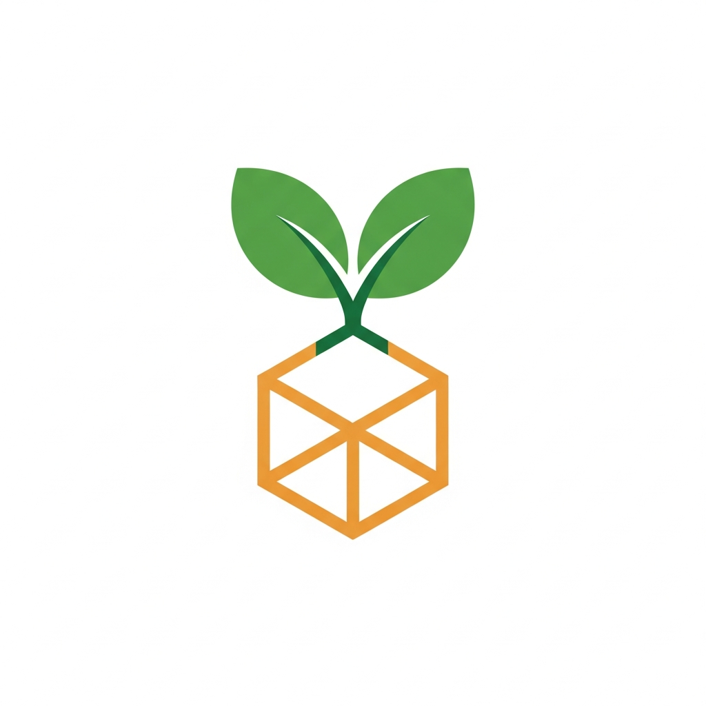

# BaseCommons

<div align="center">
  
  
  <h3>Quadratic Funding for the Commons — Built on Base</h3>
  <p><em>Many small donors outweigh a few large ones. Community breadth wins over whale depth.</em></p>

  <a href="https://github.com/agunnaya001/basecommons/actions"></a>
  <a href="https://basescan.org"></a>
  <a href="LICENSE"></a>
  <a href="https://github.com/agunnaya001/basecommons/stargazers"></a>
  <a href="https://github.com/agunnaya001/basecommons/forks"></a>
  <a href="https://github.com/agunnaya001/basecommons/issues"></a>
  <a href="https://github.com/agunnaya001/basecommons/commits/main"></a>

  <br/>
  <br/>

  
  
  
  
  
  
  
</div>

---

## What is BaseCommons?

**BaseCommons** is a **Quadratic Funding (QF)** platform on the Base blockchain where community support determines funding allocation — not wallet size.

Instead of one whale with 100 ETH drowning out 100 people with 1 ETH each, QF flips the script:

```
match(project) = (Σ √donation_i)² / Σⱼ (Σᵢ √donation_ij)² × pool
```

> **9 people donating 0.01 ETH each (0.09 ETH total)** will outmatch **1 whale donating 0.5 ETH** in the matching pool — because breadth of support is rewarded, not depth.

This is how public goods *should* be funded.

---

## ✨ Features

| Feature | Status |
|---------|--------|
| 🌱 Project creation & registration | ✅ Live |
| 💚 On-chain donations in ETH | ✅ Live |
| 📊 Live QF Match Estimator | ✅ Live |
| 🏆 Donor leaderboard | ✅ Live |
| 🔄 Multi-cycle funding rounds | ✅ Live |
| 📱 Mobile-first responsive design | ✅ Live |
| 🎨 IPFS image storage | ✅ Live |
| 🔍 Project search & category filters | ✅ Live |
| 👤 Donor profiles & history | ✅ Live |
| 🐋 Anti-whale QF algorithm | ✅ Live |
| 📢 Social sharing (X / Farcaster) | ✅ Live |
| 🏅 Project verification badges | ✅ Live |
| 🔐 Admin matching distribution | ✅ Live |
| ✅ Smart contract test suite (15 tests) | ✅ Live |
| 🔍 Basescan contract verification | 🔜 Post-deploy |

---

## 🧮 Quadratic Funding — How It Works

```
┌─────────────────────────────────────────────────────┐
│           NORMAL FUNDING vs QUADRATIC FUNDING        │
├──────────────────────┬──────────────────────────────┤
│  Project A           │  1 donor  × 100 ETH          │
│  Project B           │  100 donors × 1 ETH each     │
├──────────────────────┼──────────────────────────────┤
│  Normal Funding:     │  A gets 50%,  B gets 50%     │
│  QF Matching:        │  A gets ~9%,  B gets ~91%   │
└──────────────────────┴──────────────────────────────┘

Formula:
  QF_score(project) = (Σᵢ √donationᵢ)²

  match(project) = QF_score(project) / Σⱼ QF_score(projectⱼ) × pool
```

The quadratic formula was popularized by [Vitalik Buterin, Zoë Hitzig, and E. Glen Weyl](https://papers.ssrn.com/sol3/papers.cfm?abstract_id=3243656) as a mechanism to optimally fund public goods.

---

## 🏗️ Architecture

```
basecommons/
├── artifacts/
│   ├── basecommons/          # React + Vite frontend
│   │   ├── src/
│   │   │   ├── pages/        # Home, Project, Create, Admin
│   │   │   ├── components/   # DonateBox, QFEstimator, Nav, UI
│   │   │   ├── hooks/        # useToast, useMobile
│   │   │   └── lib/          # Utilities
│   │   └── public/           # Logo, hero images
│   └── api-server/           # Express + Drizzle API
│       └── src/
│           ├── routes/       # /projects, /donations, /stats
│           └── index.ts      # Server entry
├── contracts/                # Foundry smart contracts
│   ├── src/
│   │   └── BaseCommons.sol   # QF contract (Solidity ^0.8.20)
│   ├── test/
│   │   └── BaseCommons.t.sol # 15 unit tests
│   ├── script/
│   │   └── Deploy.s.sol      # One-command deployment
│   └── foundry.toml          # Foundry config
├── lib/
│   ├── db/                   # Drizzle schema + migrations
│   └── api-spec/             # OpenAPI 3.0 spec
└── README.md
```

**Tech Stack:**

| Layer | Technology |
|-------|------------|
| Smart Contract | Solidity 0.8.20 + Foundry |
| Blockchain | Base (L2 on Ethereum) |
| Frontend | React 18 + Vite 5 + TailwindCSS |
| Backend | Express.js + TypeScript |
| Database | PostgreSQL + Drizzle ORM |
| Package Manager | pnpm workspaces |

---

## 🚀 Getting Started

### Prerequisites

- Node.js 20+
- pnpm 8+
- Foundry (`curl -L https://foundry.paradigm.xyz | bash`)
- PostgreSQL 15+

### Installation

```bash
# Clone the repository
git clone https://github.com/agunnaya001/basecommons.git
cd basecommons

# Install all dependencies
pnpm install

# Configure environment
cp .env.example .env
# Edit .env with your DATABASE_URL and other secrets
```

### Running Locally

```bash
# Start everything (frontend + API)
pnpm dev

# Or start individually:
pnpm --filter @workspace/api-server run dev     # API on :3001
pnpm --filter @workspace/basecommons run dev    # Frontend on :5173
```

### Building for Production

```bash
pnpm build
pnpm start
```

---

## 📜 Smart Contract

### Contract Summary

| Property | Value |
|----------|-------|
| Language | Solidity ^0.8.20 |
| License | MIT |
| Network | Base Mainnet / Base Sepolia |
| Test Coverage | 15 unit tests |

### Core Functions

```solidity
// Register your project
function registerProject(string name, string description, string imageURI)
  returns (uint256 projectId)

// Donate ETH to a project (funds go directly to recipient)
function donate(uint256 projectId) payable

// Fund the matching pool
function fundMatchingPool() payable

// Estimate QF matching before distribution
function estimateMatching()
  returns (uint256[] ids, uint256[] amounts)

// Admin: distribute matching (QF algorithm)
function distributeMatching() onlyAdmin
```

### Deploy

```bash
# Set environment variables
export WALLET_PRIVATE_KEY=your_private_key
export BASESCAN_API_KEY=your_basescan_key  
export ADMIN_ADDRESS=0x...                  # Optional, defaults to deployer

# Deploy to Base Sepolia (testnet)
bash contracts/deploy.sh sepolia

# Deploy to Base Mainnet
bash contracts/deploy.sh mainnet
```

**Deployer wallet:** `0xFfb6505912FCE95B42be4860477201bb4e204E9f`  
*Fund this address with at least 0.01 ETH on Base before deploying.*

### Run Tests

```bash
cd contracts
forge test -vv

# Coverage report
forge coverage
```

**Test Results:**
```
✅ test_RegisterProject
✅ test_RegisterMultipleProjects
✅ test_RevertEmptyName
✅ test_Donate
✅ test_UniqueDonarCount
✅ test_RevertZeroDonation
✅ test_RevertInvalidProject
✅ test_FundMatchingPool
✅ test_FallbackFundsPool
✅ test_DistributeMatching_QFMath  ← 9 small donors beat 1 whale!
✅ test_RevertDistribute_OnlyAdmin
✅ test_RevertDistribute_EmptyPool
✅ test_CycleResets
✅ test_EstimateMatching
✅ test_DeactivateProject

15/15 passed ✅
```

---

## 🌐 API Reference

Base URL: `https://base-commons-mobile--agunnaya001.replit.app/`

| Method | Endpoint | Description |
|--------|----------|-------------|
| GET | `/projects` | List all projects |
| POST | `/projects` | Create a new project |
| GET | `/projects/:id` | Get project details |
| GET | `/donations` | List all donations |
| POST | `/donations` | Record a donation |
| GET | `/stats` | Platform statistics |
| GET | `/stats/leaderboard` | Donor leaderboard |
| GET | `/stats/activity` | Recent activity feed |
| GET | `/funding-cycles` | Funding cycle history |

Full spec: [`lib/api-spec/openapi.yaml`](lib/api-spec/openapi.yaml)

---

## 🖼️ Screenshots

| Home | Project Detail | Create Project | Admin |
|------|---------------|----------------|-------|
|  |  |  |  |

---

## 🤝 Contributing

Contributions are welcome! Here's how:

1. **Fork** the repository
2. **Create** your feature branch: `git checkout -b feature/amazing-feature`
3. **Commit** your changes: `git commit -m 'feat: add amazing feature'`
4. **Push** to your branch: `git push origin feature/amazing-feature`
5. **Open** a Pull Request

Please follow [Conventional Commits](https://www.conventionalcommits.org/) for commit messages.

### Development Guidelines

- Run `forge test` before submitting contract changes
- Maintain 90%+ test coverage on the smart contract
- Follow existing code style (Prettier + ESLint for frontend, Foundry fmt for Solidity)
- Write meaningful PR descriptions

---

## 🗺️ Roadmap

- [ ] **Gitcoin Passport integration** — Sybil-resistance for donors
- [ ] **IPFS image uploads** — Decentralized project media
- [ ] **Multi-token matching** — Accept USDC, DAI for matching pool
- [ ] **DAO governance** — Community-voted project acceptance
- [ ] **ENS/Basename profiles** — Human-readable donor identities
- [ ] **Farcaster Frames** — Donate directly from Warpcast
- [ ] **Mobile app** — React Native / Expo
- [ ] **Retroactive rounds** — Reward past contributions
- [ ] **ZK proofs** — Private but verifiable donations

---

## 🙏 Sponsors & Acknowledgements

BaseCommons is inspired by the groundbreaking work of:

- **[Gitcoin](https://gitcoin.co)** — Pioneering QF for public goods
- **[Vitalik Buterin](https://vitalik.ca)** — Co-author of the QF paper
- **[Base](https://base.org)** — L2 infrastructure enabling low-cost donations
- **[Paradigm](https://paradigm.xyz)** — Foundry, the gold standard for Solidity dev

---

## 📄 License

MIT © 2026 [agunnaya001](https://github.com/agunnaya001)

---

<div align="center">
  <sub>Built with 💚 on Base. Fund what matters. Fund what the community loves.</sub>
  <br/>
  <sub><a href="https://github.com/agunnaya001/basecommons">⭐ Star this repo</a> if BaseCommons helped you!</sub>
</div>
